# Quantum Computing
Quantum Algorithms with Java and Strange

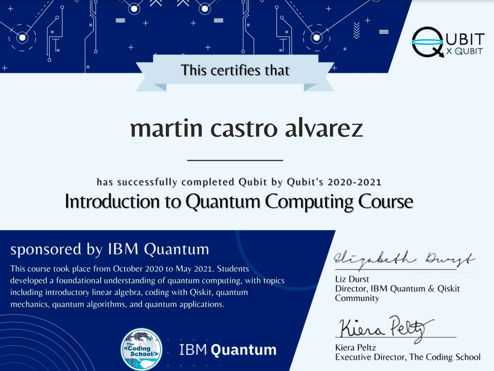

## References

- [Strange](https://github.com/redfx-quantum/strange)
- [StrangeFX](https://github.com/redfx-quantum/strangefx)
- [Quantum Computing samples in Java](https://github.com/johanvos/quantumjava)
- [How to Install Maven on Linux (Ubuntu)](https://www.digitalocean.com/community/tutorials/install-maven-linux-ubuntu)
- [Quantum Logic Gate](https://en.wikipedia.org/wiki/Quantum_logic_gate)
- [Quantum Key Distribution and BB84 Protocol](https://en.wikipedia.org/wiki/BB84)
- [Deutsch–Jozsa algorithm](https://en.wikipedia.org/wiki/Grover%27s_algorithm)
- [Grover's algorithm](https://en.wikipedia.org/wiki/Shor%27s_algorithm)
- [Shor's Algorithm](https://en.wikipedia.org/wiki/Deutsch%E2%80%93Jozsa_algorithm)

## Instructions

### Installing JDK on Linux

Downloading the JDK Binaries

```bash
wget https://download.java.net/java/GA/jdk13.0.1/cec27d702aa74d5a8630c65ae61e4305/9/GPL/openjdk-13.0.1_linux-x64_bin.tar.gz
tar -xvf openjdk-13.0.1_linux-x64_bin.tar.gz
sudo mv jdk-13.0.1 /opt/
```

Setting `JAVA_HOME` and Path Environment Variables

```bash
JAVA_HOME='/opt/jdk-13.0.1'
PATH="$JAVA_HOME/bin:$PATH"
export PATH
```

Verifing the Java Installation

```bash
java -version
```

### Installing Maven on Linux

Downloading the Maven Binaries

```bash
wget https://mirrors.estointernet.in/apache/maven/maven-3/3.6.3/binaries/apache-maven-3.6.3-bin.tar.gz
tar -xvf apache-maven-3.6.3-bin.tar.gz
sudo mv apache-maven-3.6.3 /opt/
```

Setting `M2_HOME` and Path Variables

```bash
M2_HOME='/opt/apache-maven-3.6.3'
PATH="$M2_HOME/bin:$PATH"
export PATH
```

Verifing the Maven installation

```bash
mvn -version
```

## Quantum Algorithms

### Quantum Superposition

Putting a Qubit into superposition using a `Hadarmard` gate.

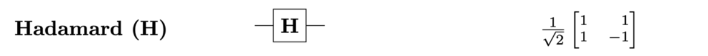

```bash
mvn clean javafx:run --quiet --file superposition.xml
```
```bash
Qubit | Probability: 0.4999999701976776, Mesured: 0
```

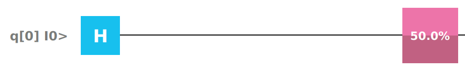

### Quantum Entanglement

Entangling 2 Qubits using a `CNOT` gate.

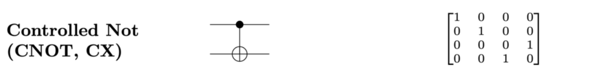

```bash
mvn clean javafx:run --quiet --file entanglement.xml
```
```bash
Qubit | Probability: 0.0, Mesured: 0
Qubit | Probability: 0.0, Mesured: 0
```

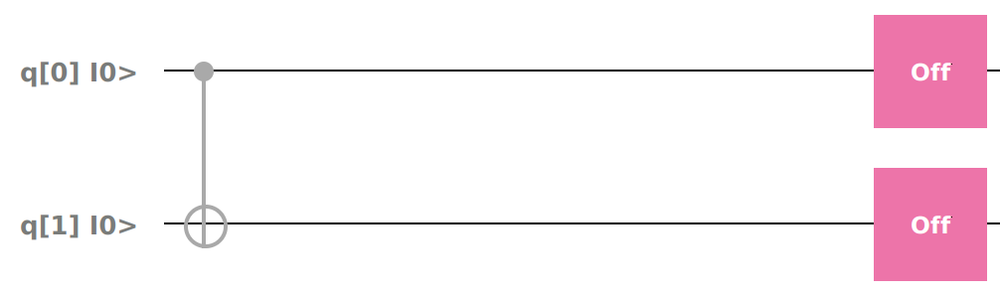

### Bell State

Entangling 2 Qubits in superposition to create a Bell state using a `Hadamard` gate and a `CNOT` gate.

```bash
mvn clean javafx:run --quiet --file bell.xml
```

This results on both Qubits being either 0 or 1 50% of the time.

```bash
Qubit | Probability: 0.4999999701976776, Mesured: 0
Qubit | Probability: 0.4999999701976776, Mesured: 0
```
```bash
Qubit | Probability: 0.4999999701976776, Mesured: 1
Qubit | Probability: 0.4999999701976776, Mesured: l
```

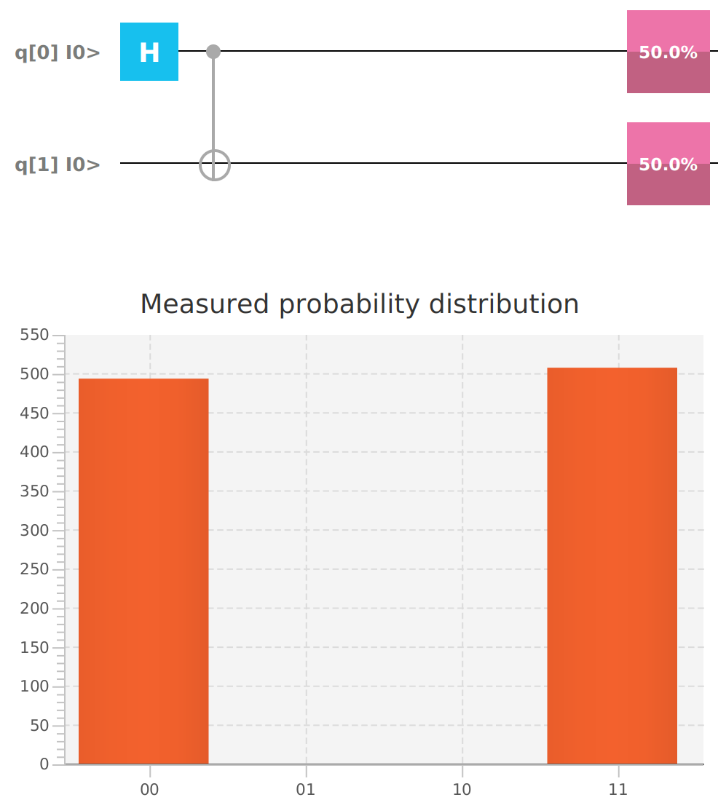

Adding an additional `X` gate to the second Qubit.


```bash
mvn clean javafx:run --quiet --file bell2.xml
```

It causes the Qubits to be measures as either 0 and 1 or 1 and 0 50% of the time.

```bash
Qubit | Probability: 0.4999999701976776, Mesured: 0
Qubit | Probability: 0.4999999701976776, Mesured: 1
```
```bash
Qubit | Probability: 0.4999999701976776, Mesured: 1
Qubit | Probability: 0.4999999701976776, Mesured: 0
```

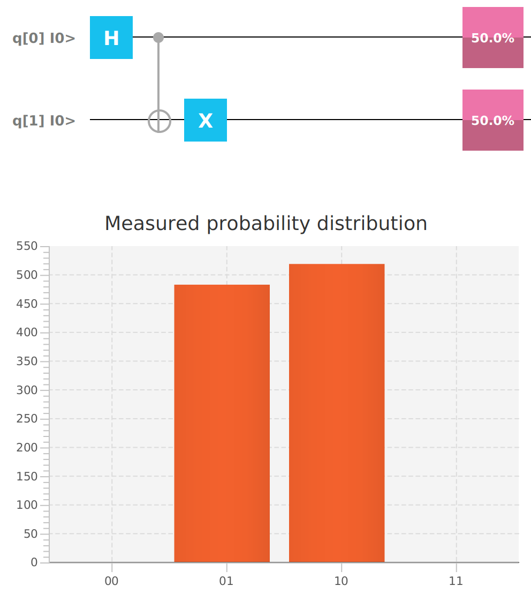

### Quantum Teleportation

Teleporting a Qubit from Alice to Bob by combining `Hadamard` and `CNOT` gates as well as a `CZ` gate.

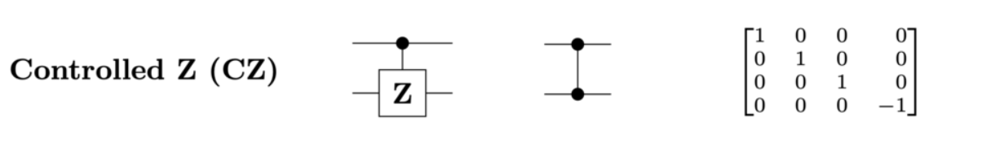

```bash
mvn clean javafx:run --quiet --file teleport.xml
```

The last Qubit is guaranteed to always be 0. That means the 0 was teleported from Alice to Bob.

```bash
Qubit | Probability: 0.4999999403953552, Mesured: 0
Qubit | Probability: 0.4999999403953552, Mesured: 1
Qubit | Probability: 0.0, Mesured: 0
```

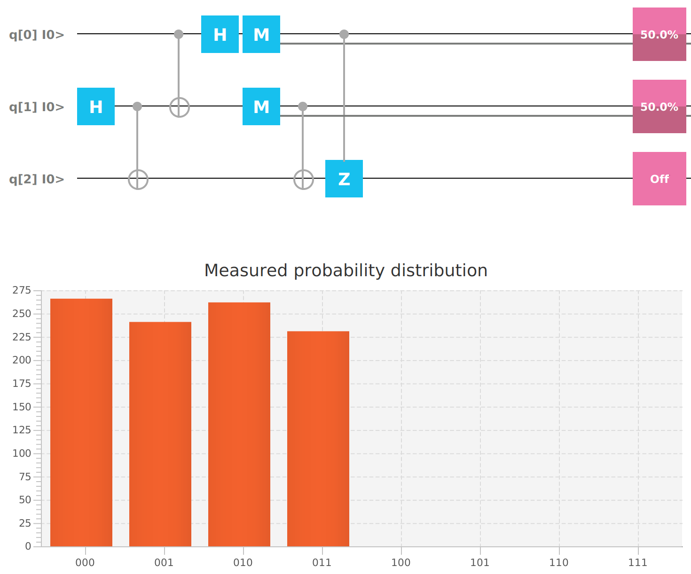

Now, initializing the first Qubit to 1.

```bash
mvn clean javafx:run --quiet --file teleport1.xml
```

Now, the value 1 has been teleported from Alice to Bob.

```bash
Qubit | Probability: 0.4999999403953552, Mesured: 1
Qubit | Probability: 0.4999999403953552, Mesured: 0
Qubit | Probability: 0.9999998807907104, Mesured: 1
```

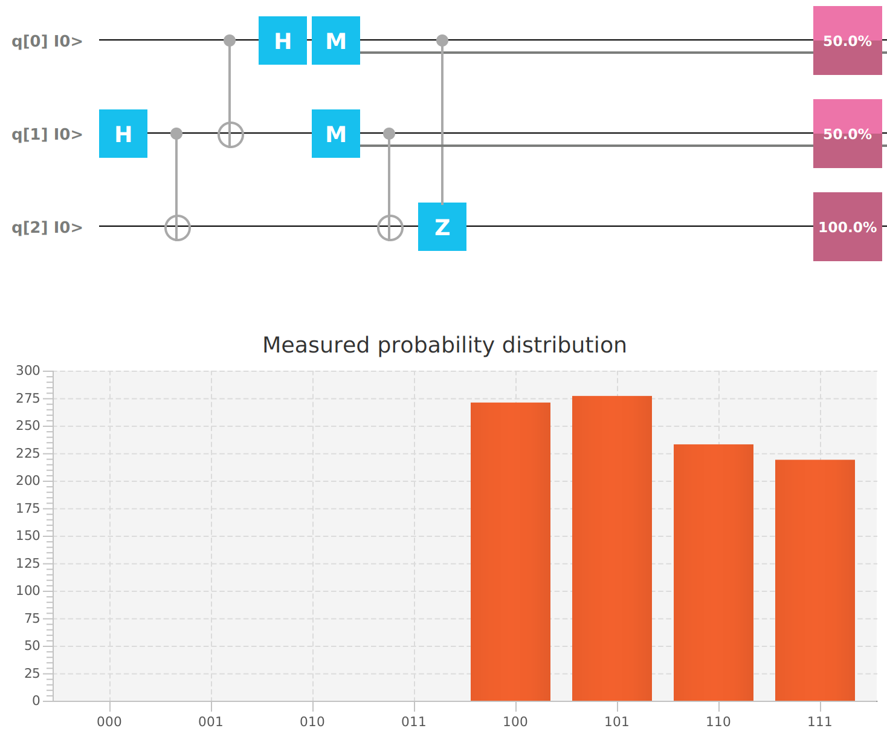

Now, initializing the first Qubit to 53%.

```bash
mvn clean javafx:run --quiet --file teleport53.xml
```

Now, the value 0.53 has been teleported from Alice to Bob after applying the formula `1 - 0.53 * 0.53 = 0.719`.

```bash
Qubit | Probability: 0.4999999403953552, Mesured: 1
Qubit | Probability: 0.4999999403953552, Mesured: 0
Qubit | Probability: 0.7190999388694763, Mesured: 0
```

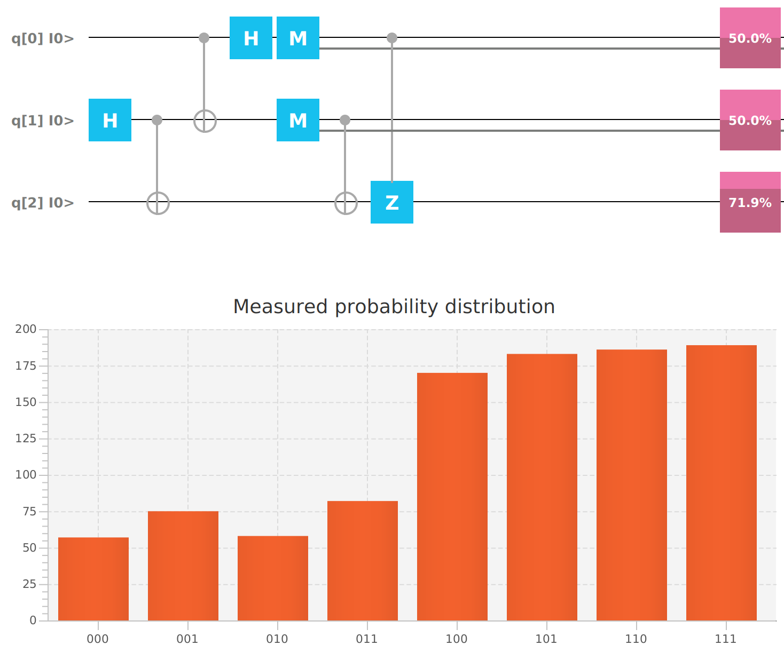

### Quantum Network

Creating a network of Qubits by concatenating multiple Quantum Teleporters.

```bash
mvn clean javafx:run --quiet --file network.xml
```

The message `0.21` is teleported from Alice to Bob across a larger distance after applying the formula `1 - 0.21 * 0.21 = 0.9558`

```bash
Qubit | Probability: 0.4999998528510332, Mesured: 1
Qubit | Probability: 0.4999998528510332, Mesured: 1
Qubit | Probability: 0.4999998528510332, Mesured: 1
Qubit | Probability: 0.4999998528510332, Mesured: 1
Qubit | Probability: 0.4999998528510332, Mesured: 1
Qubit | Probability: 0.4999998528510332, Mesured: 1
Qubit | Probability: 0.4999998528510332, Mesured: 1
Qubit | Probability: 0.4999998528510332, Mesured: 1
Qubit | Probability: 0.4999998528510332, Mesured: 0
Qubit | Probability: 0.4999998528510332, Mesured: 0
Qubit | Probability: 0.955899715423584, Mesured: 1
```

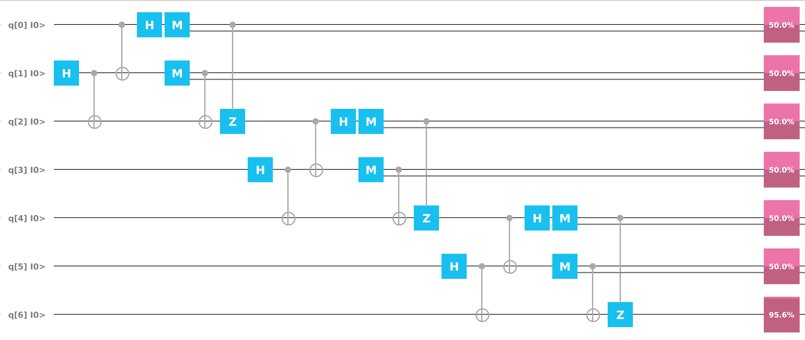

### Quantum Inverter

Inverting the state of 2 Qubits by applying 3 consecutive `CNOT` gates.

```bash
mvn clean javafx:run --quiet --file inverter.xml
```

The message `0.2` and `0.5` have been inverted after applying the formulas: `1 - 0.2 * 0.2 = 0.96` and `1 - 0.5 * 0.5 = 0.75`.

```bash
Qubit | Probability: 0.9599999040365219, Mesured: 1
Qubit | Probability: 0.7499999087303877, Mesured: 1
```

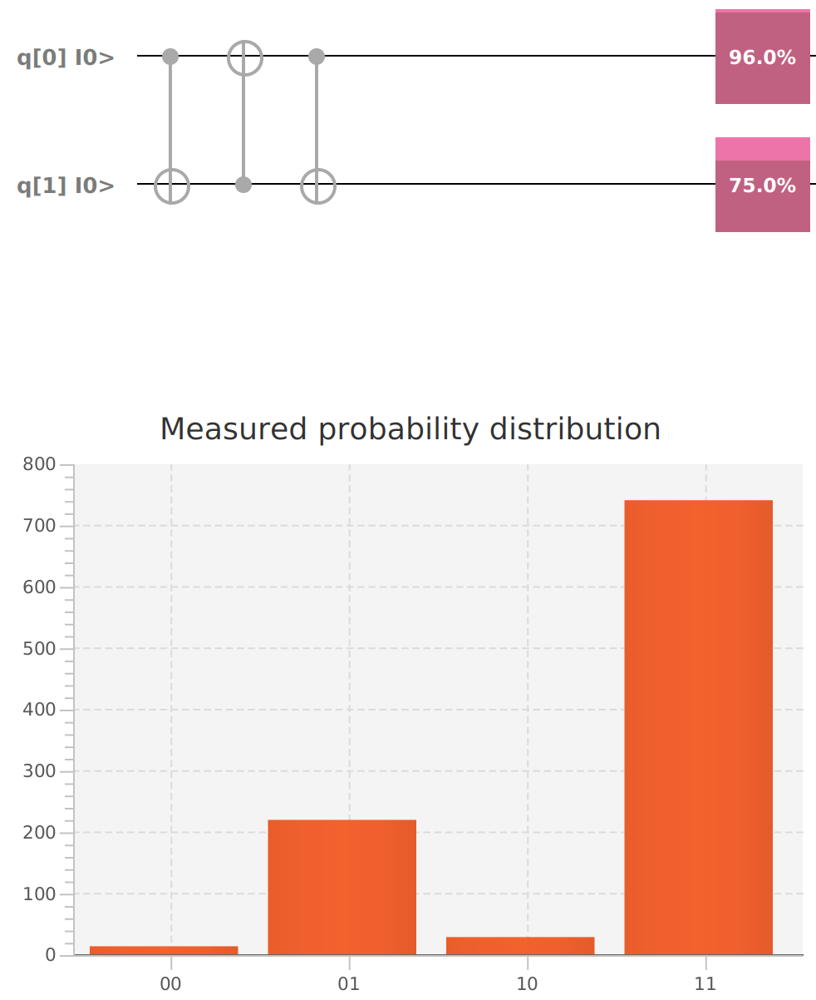

The inverter can be used to teleport a Qubit while only applying the `CNOT` and `CZ` gates to contiguous gates so that they can be easily calculated mathematically.

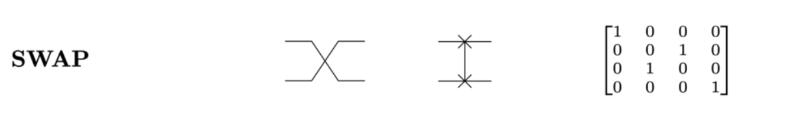

```bash
mvn clean javafx:run --quiet --file swap.xml
```

The message `0.41` is teleported from Alice to Bob after swapping the state of the first 2 Qubits.

```bash
Qubit | Probability: 0.5, Mesured: 0
Qubit | Probability: 0.5, Mesured: 0
Qubit | Probability: 0.8319000005722046, Mesured: 1
```

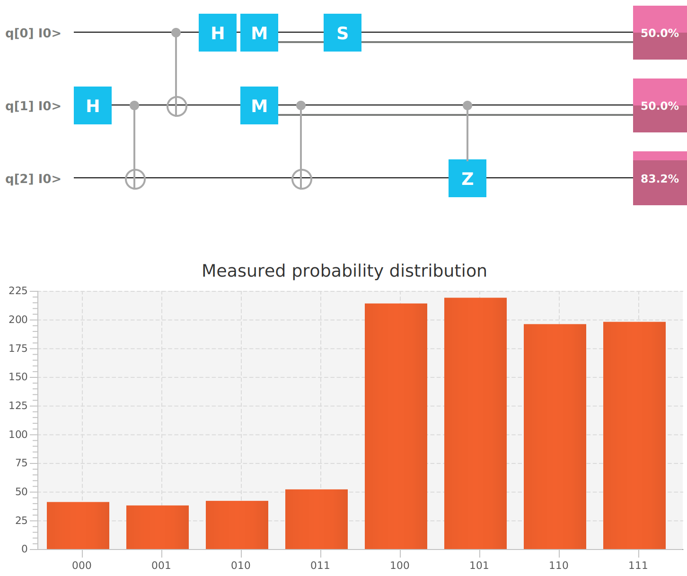

### Quantum Adder

Summing the value of 2 Qubits using a `Toffoli` gate. The first Qubit is kept to guarantee the Quantum Reversibility Principle. The last Qubit is the carry bit.

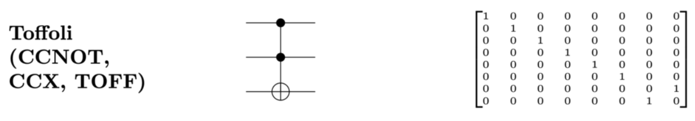

```bash
mvn clean javafx:run --quiet --file adder00.xml
```

Two `|0>` Qubits sum `|00>`.

```bash
Qubit | Probability: 0.0, Mesured: 0
Qubit | Probability: 0.0, Mesured: 0
Qubit | Probability: 0.0, Mesured: 0
```

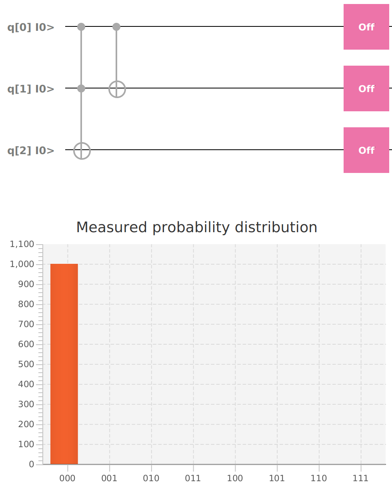

Adding two `|1>` Qubits:

```bash
mvn clean javafx:run --quiet --file adder11.xml
```

Two `|1>` Qubits sum `|10>`.

```bash
Qubit | Probability: 0.0, Mesured: 0
Qubit | Probability: 1.0, Mesured: 1
Qubit | Probability: 1.0, Mesured: 1
```

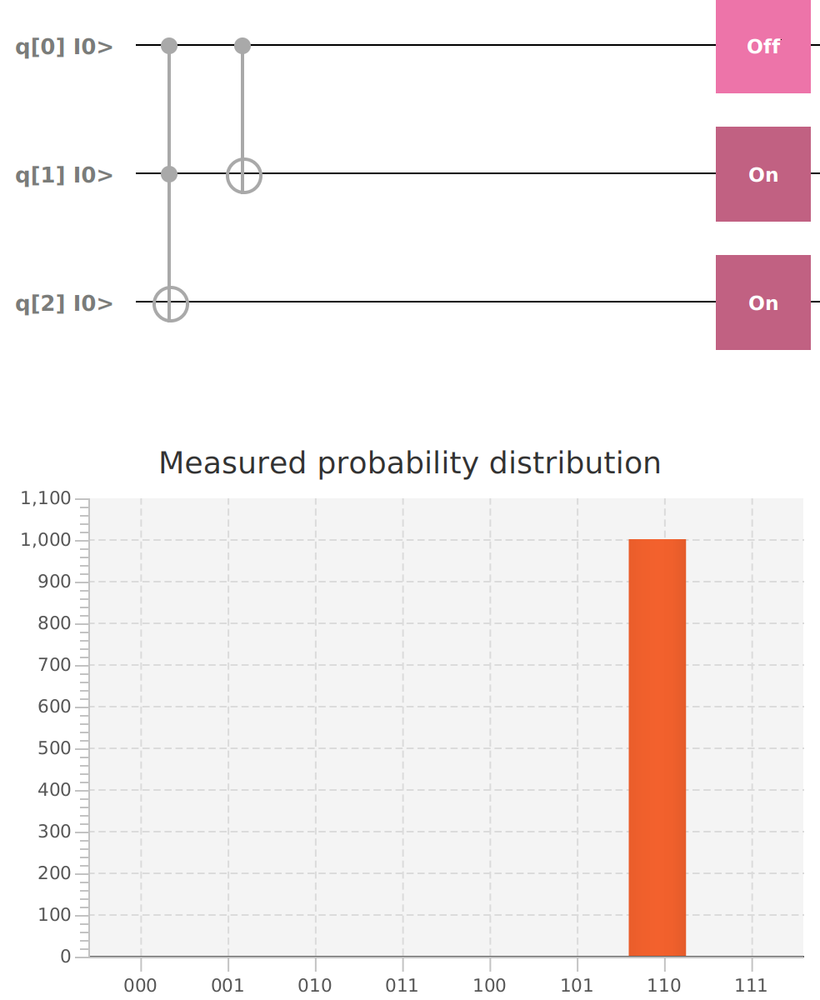

Adding `|1>` + `|0>` + `|0>`:

```bash
mvn clean javafx:run --quiet --file adder100.xml
```

The sum of `|1>` + `|0>` + `|0>` results in `|01>` (The last 2 Qubits):

```bash
Qubit | Probability: 0.0, Mesured: 0
Qubit | Probability: 0.0, Mesured: 0
Qubit | Probability: 0.0, Mesured: 0
Qubit | Probability: 0.0, Mesured: 0
Qubit | Probability: 1.0, Mesured: 1
```

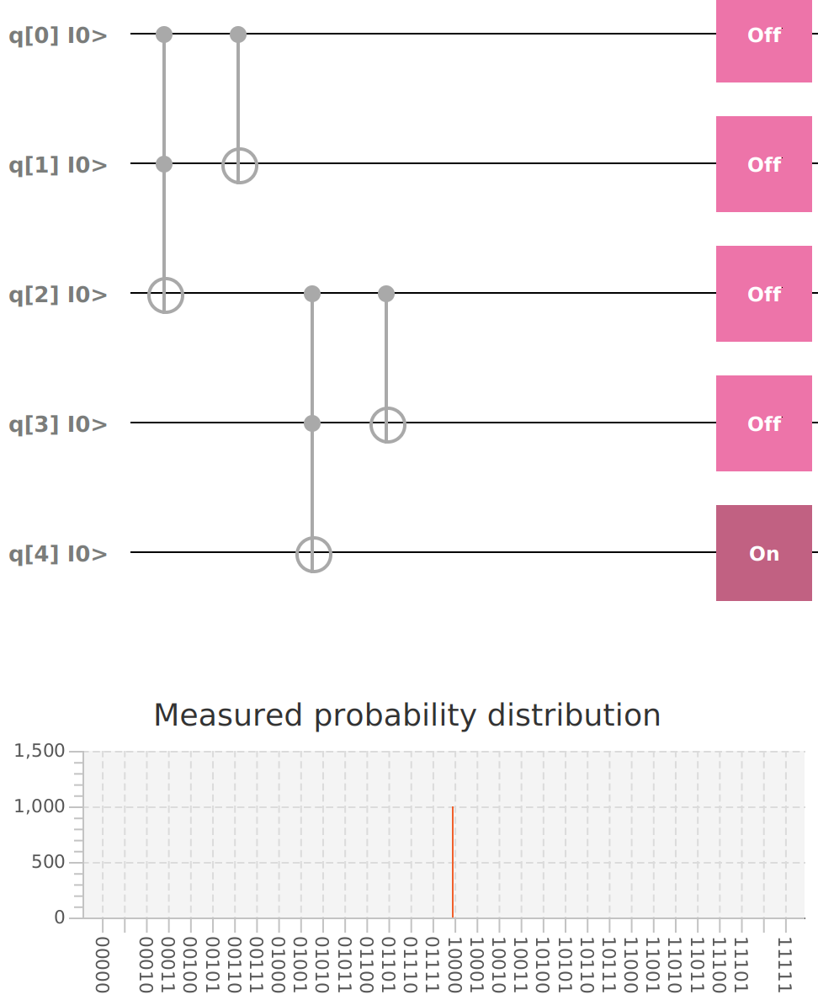

Adding `|1>` + `|0>` + `|1>`:

```bash
mvn clean javafx:run --quiet --file adder101.xml
```

The sum of `|1>` + `|0>` + `|1>` results in `|10>` (the last 2 Qubits):

```bash
Qubit | Probability: 0.0, Mesured: 0
Qubit | Probability: 1.0, Mesured: 1
Qubit | Probability: 0.0, Mesured: 0
Qubit | Probability: 0.0, Mesured: 0
Qubit | Probability: 1.0, Mesured: 1
```

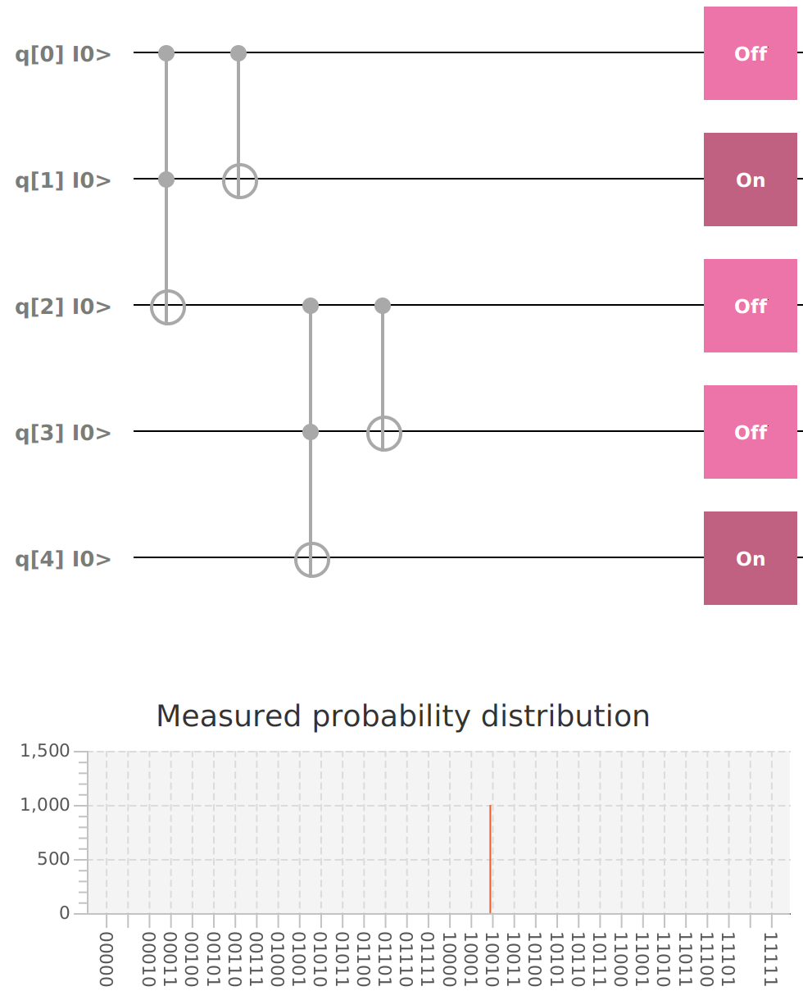

Adding `|1>` + `|1>` + `|1>`:

```bash
mvn clean javafx:run --quiet --file adder111.xml
```

The sum of `|1>` + `|1>` + `|1>` results in `|11>` (The last 2 Qubits):

```bash
Qubit | Probability: 0.0, Mesured: 0
Qubit | Probability: 1.0, Mesured: 1
Qubit | Probability: 0.0, Mesured: 0
Qubit | Probability: 1.0, Mesured: 1
Qubit | Probability: 1.0, Mesured: 1
```

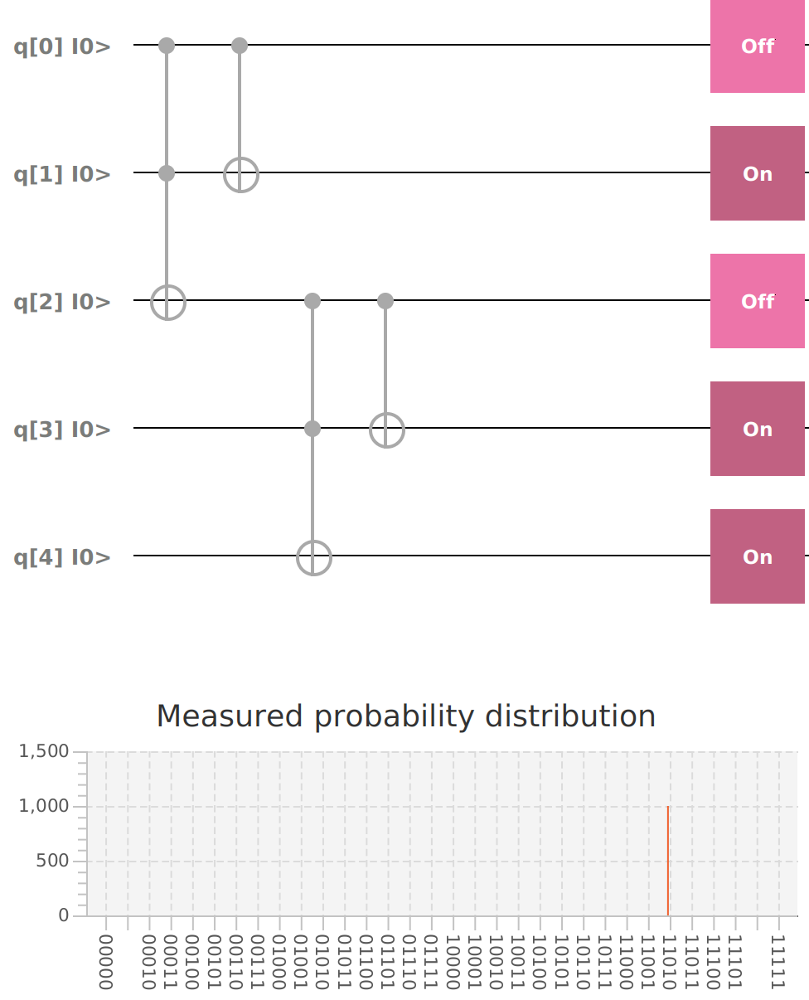

### BB84 Algorithm

Sending a message over the network, taking advantage of the `Hadamard` gate resulting in the original Qubit if applied twice.

```bash
mvn clean javafx:run --quiet --file bb84.xml
```

The `|1001>` Qubits sent by Alice are received as `|1001>` by Bob.

```bash
Qubit | Probability: 0.9999997615814209, Mesured: 1
Qubit | Probability: 0.0, Mesured: 0
Qubit | Probability: 0.0, Mesured: 0
Qubit | Probability: 0.9999997615814209, Mesured: 1
```

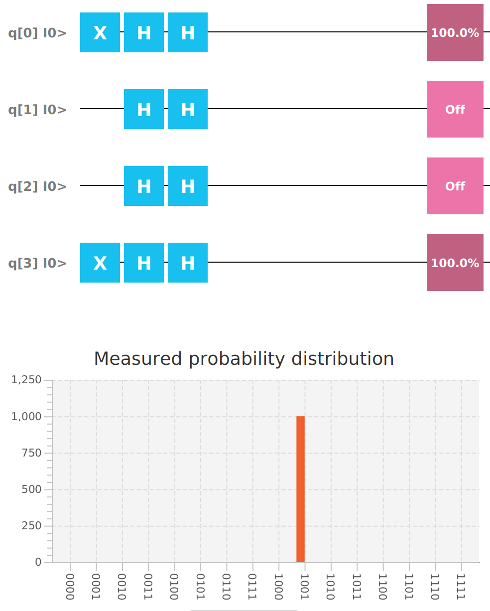

Eve is listening on the network and randomly applies `Hadamard` gates to try to get the message. After that, retransmits the Qubit to Bob who applies the same `Hadamard` configuration that Alice randomly applied.

```bash
mvn clean javafx:run --quiet --file eavesdropping.xml
```

The `|1001>` Qubits sent by Alice are not properly received by Eve, who can not forward a message to Bob without him noticing that the message has been tampered.

```bash
Qubit | Probability: 0.9999997615814209, Mesured: 1
Qubit | Probability: 0.49999988079071045, Mesured: 1
Qubit | Probability: 0.0, Mesured: 0
Qubit | Probability: 0.49999988079071045, Mesured: 1
```

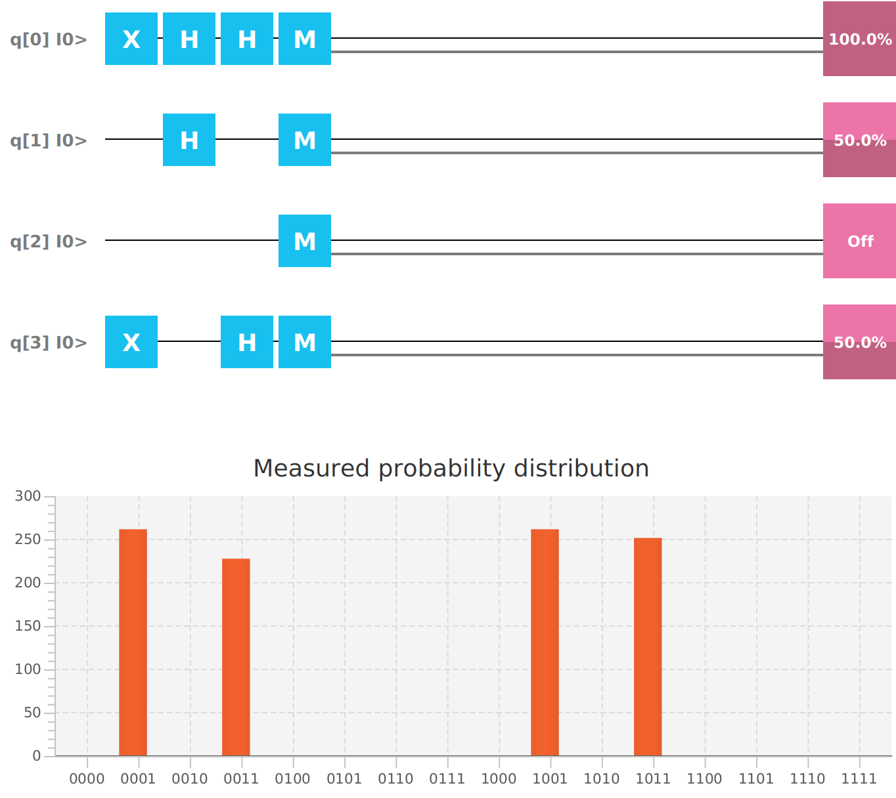

### Deutsch Josza Algorithm

Running the Deutsch Algorithm with a random Oracle that is unknown at run time:

```bash
mvn clean javafx:run --quiet --file deutschjozsa.xml
```

If the Oracle is a constant function, the measured value of the first Qubit is guaranteed to be 0.
If the Oracle is a balanced function, the measured value of the first Qubit is guaranteed to be 1.

```bash
Qubit | Function: 0 Type: constant
Qubit | Probability: 0.0, Mesured: 0
Qubit | Probability: 0.49999991059303284, Mesured: 1
----------------------------------------------------
Qubit | Function: 1 Type: balanced
Qubit | Probability: 0.9999998211860657, Mesured: 1
Qubit | Probability: 0.49999991059303284, Mesured: 0
----------------------------------------------------
Qubit | Function: 0 Type: constant
Qubit | Probability: 0.0, Mesured: 0
Qubit | Probability: 0.49999991059303284, Mesured: 1
----------------------------------------------------
Qubit | Function: 1 Type: balanced
Qubit | Probability: 0.9999998211860657, Mesured: 1
Qubit | Probability: 0.49999991059303284, Mesured: 0
----------------------------------------------------
Qubit | Function: 1 Type: balanced
Qubit | Probability: 0.9999998211860657, Mesured: 1
Qubit | Probability: 0.49999991059303284, Mesured: 1
----------------------------------------------------
Qubit | Function: 0 Type: constant
Qubit | Probability: 0.0, Mesured: 0
Qubit | Probability: 0.49999991059303284, Mesured: 0
----------------------------------------------------
Qubit | Function: 0 Type: constant
Qubit | Probability: 0.0, Mesured: 0
Qubit | Probability: 0.49999991059303284, Mesured: 1
----------------------------------------------------
Qubit | Function: 1 Type: balanced
Qubit | Probability: 0.9999998211860657, Mesured: 1
Qubit | Probability: 0.49999991059303284, Mesured: 0
----------------------------------------------------
Qubit | Function: 0 Type: constant
Qubit | Probability: 0.0, Mesured: 0
Qubit | Probability: 0.49999991059303284, Mesured: 1
----------------------------------------------------
Qubit | Function: 1 Type: balanced
Qubit | Probability: 0.9999998211860657, Mesured: 1
Qubit | Probability: 0.49999991059303284, Mesured: 0
```

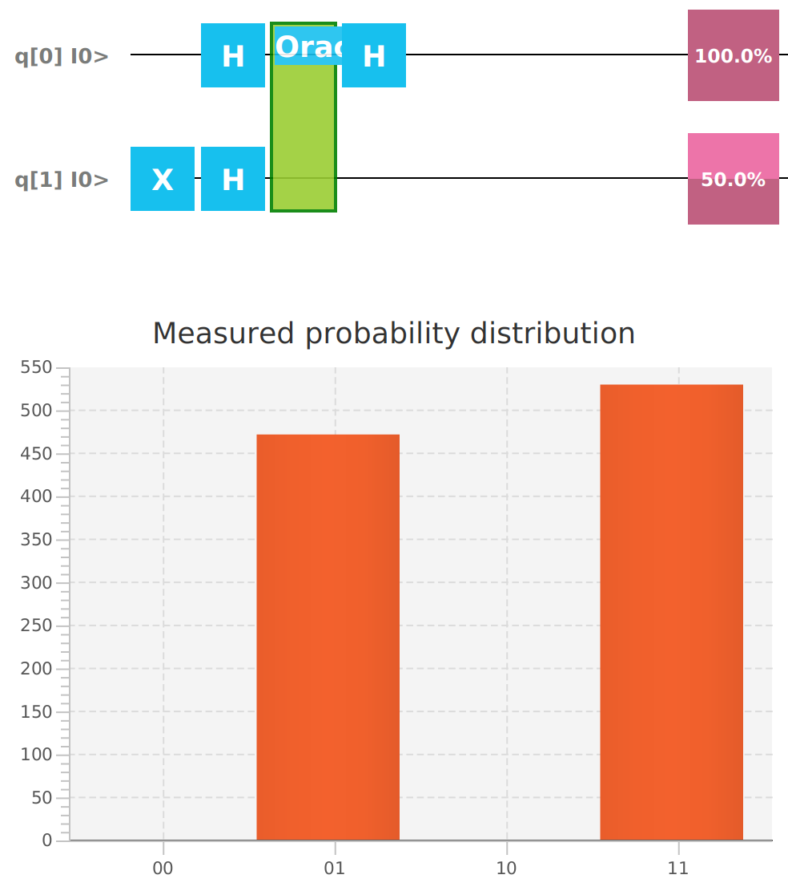

Running the Deutsch Algorithm with 2 Qubits.

```bash
mvn clean javafx:run --quiet --file deutschjozsa2.xml
```

If the Oracle is a constant function, the measured value of the first Qubit is guaranteed to be 0.
If the Oracle is a balanced function, the measured value of the first Qubit is guaranteed to be 1.

```bash
Qubit | Function: 1 Type: balanced
Qubit | Probability: 0.9999998211860657, Mesured: 1
Qubit | Probability: 0.0, Mesured: 0
Qubit | Probability: 0.49999991059303284, Mesured: 0
----------------------------------------------------
Qubit | Function: 0 Type: constant
Qubit | Probability: 0.0, Mesured: 0
Qubit | Probability: 0.0, Mesured: 0
Qubit | Probability: 0.49999991059303284, Mesured: 0
----------------------------------------------------
Qubit | Function: 0 Type: constant
Qubit | Probability: 0.0, Mesured: 0
Qubit | Probability: 0.0, Mesured: 0
Qubit | Probability: 0.49999991059303284, Mesured: 0
```

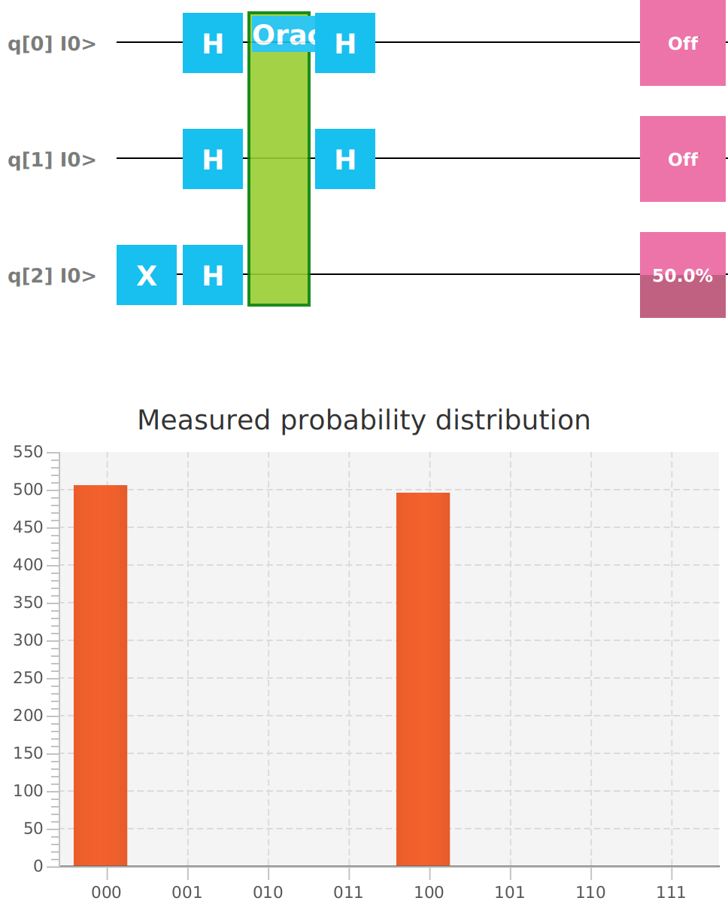

Running the Deutsch Algorithm with 3 Qubits.

```bash
mvn clean javafx:run --quiet --file deutschjozsa3.xml
```

If the Oracle is a constant function, the measured value of the first Qubit is guaranteed to be 0.
If the Oracle is a balanced function, the measured value of the first Qubit is guaranteed to be 1.

```bash
Qubit | Function: 0 Type: constant
Qubit | Probability: 0.0, Mesured: 0
Qubit | Probability: 0.0, Mesured: 0
Qubit | Probability: 0.0, Mesured: 0
Qubit | Probability: 0.49999991059303284, Mesured: 0
----------------------------------------------------
Qubit | Function: 0 Type: constant
Qubit | Probability: 0.0, Mesured: 0
Qubit | Probability: 0.0, Mesured: 0
Qubit | Probability: 0.0, Mesured: 0
Qubit | Probability: 0.49999991059303284, Mesured: 1
----------------------------------------------------
Qubit | Function: 1 Type: balanced
Qubit | Probability: 0.9999998211860657, Mesured: 1
Qubit | Probability: 0.0, Mesured: 0
Qubit | Probability: 0.0, Mesured: 0
Qubit | Probability: 0.49999991059303284, Mesured: 0
```

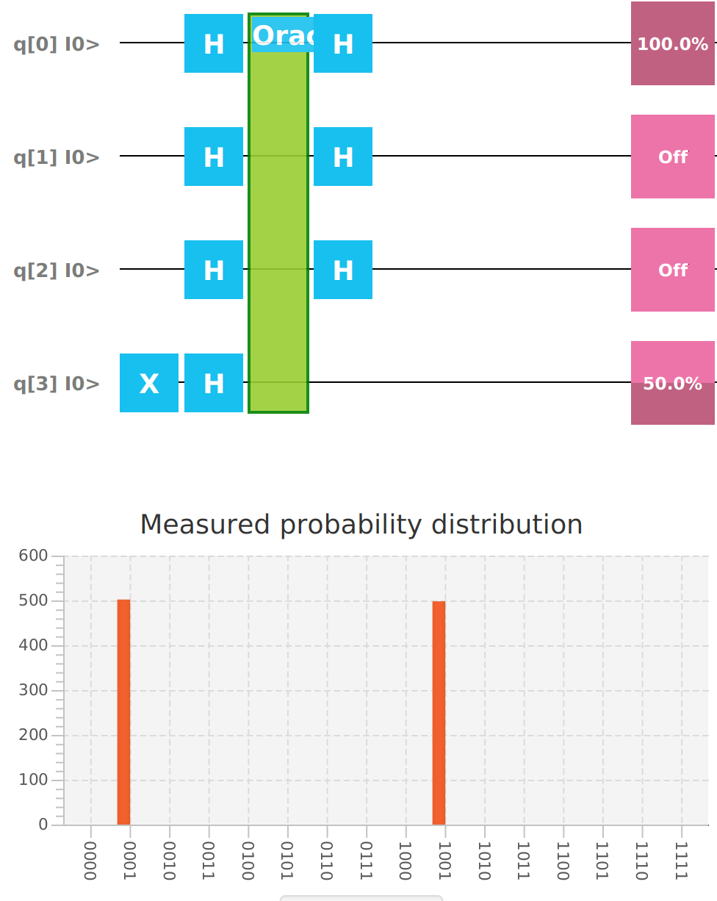

Running the Deutsch-Jozsa Algorithm with N Qubits.

```bash
mvn clean javafx:run --quiet --file deutschjozsa10.xml
```

If the Oracle is a constant function, the measured value of the first Qubit is guaranteed to be 0.
If the Oracle is a balanced function, the measured value of the first Qubit is guaranteed to be 1.

```bash
Qubit | Function: 0 Type: constant
Qubit | Probability: 0.0, Mesured: 0
Qubit | Probability: 0.0, Mesured: 0
Qubit | Probability: 0.0, Mesured: 0
Qubit | Probability: 0.0, Mesured: 0
Qubit | Probability: 0.0, Mesured: 0
Qubit | Probability: 0.0, Mesured: 0
Qubit | Probability: 0.0, Mesured: 0
Qubit | Probability: 0.0, Mesured: 0
Qubit | Probability: 0.0, Mesured: 0
Qubit | Probability: 0.0, Mesured: 0
Qubit | Probability: 0.49999991059303284, Mesured: 0
----------------------------------------------------
Qubit | Function: 0 Type: constant
Qubit | Probability: 0.0, Mesured: 0
Qubit | Probability: 0.0, Mesured: 0
Qubit | Probability: 0.0, Mesured: 0
Qubit | Probability: 0.0, Mesured: 0
Qubit | Probability: 0.0, Mesured: 0
Qubit | Probability: 0.0, Mesured: 0
Qubit | Probability: 0.0, Mesured: 0
Qubit | Probability: 0.0, Mesured: 0
Qubit | Probability: 0.0, Mesured: 0
Qubit | Probability: 0.0, Mesured: 0
Qubit | Probability: 0.49999991059303284, Mesured: 0
----------------------------------------------------
Qubit | Function: 1 Type: balanced
Qubit | Probability: 0.9999998211860657, Mesured: 1
Qubit | Probability: 0.0, Mesured: 0
Qubit | Probability: 0.0, Mesured: 0
Qubit | Probability: 0.0, Mesured: 0
Qubit | Probability: 0.0, Mesured: 0
Qubit | Probability: 0.0, Mesured: 0
Qubit | Probability: 0.0, Mesured: 0
Qubit | Probability: 0.0, Mesured: 0
Qubit | Probability: 0.0, Mesured: 0
Qubit | Probability: 0.0, Mesured: 0
Qubit | Probability: 0.49999991059303284, Mesured: 0
```

### Grover's Search Algorithm

Running the Deutsch Algorithm with a random Oracle that is unknown at run time:

```bash
mvn clean javafx:run --quiet --file grover.xml
```

The algorithm iterates multiple times applying the `Oracle` and the `Diffusor`. In each iteration, the probability of measuring the expected solution increases.

In this case, there are 3 Qubits which can encode 8 values. In other words, 3 Qubits can be used to search for a match among 8 records.

```bash
Qubits | Qubits: 3 Encoded: 8 Solution: 2 Runs: 2.221441469079183
----------------------------------------------------
Correct Solution Probability after step 1: 0.7812497615814209
Correct Solution Probability after step 2: 0.9453120827674866
----------------------------------------------------
Probability distribution at step: 1
p: 0.031249988824129105
p: 0.031249988824129105
p: 0.7812497615814209
p: 0.031249988824129105
p: 0.031249988824129105
p: 0.031249994412064552
p: 0.031249988824129105
p: 0.031249983236193657
----------------------------------------------------
Probability distribution at step: 2
p: 0.007812506519258022
p: 0.007812506519258022
p: 0.9453120827674866
p: 0.007812506519258022
p: 0.007812500931322575
p: 0.007812506519258022
p: 0.007812500931322575
p: 0.007812498603016138
```

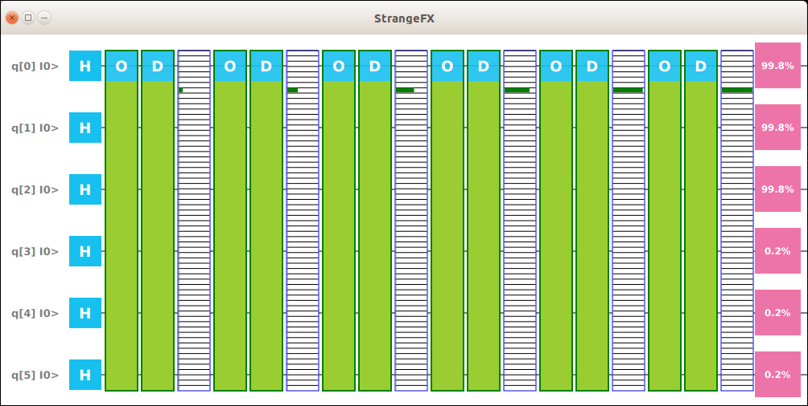

Running the Deutsch Algorithm with a random Oracle that is unknown at run time:

```bash
mvn clean javafx:run --quiet --file grovern.xml
```

This time, the Grover's Search algorithm is able to search for a match among 256 records. As a conclusion, the computation increases exponentially with the amount of entangled Qubits.

```bash
Qubits | Qubits: 8 Encoded: 256.0 Solution: 2 Runs: 12.566370614359172
----------------------------------------------------
Correct Solution Probability after step 1: 0.03479098901152611
Correct Solution Probability after step 2: 0.09463772177696228
Correct Solution Probability after step 3: 0.17972062528133392
Correct Solution Probability after step 4: 0.2847433090209961
Correct Solution Probability after step 5: 0.40317079424858093
Correct Solution Probability after step 6: 0.527620255947113
Correct Solution Probability after step 7: 0.6503432393074036
[...]
```
